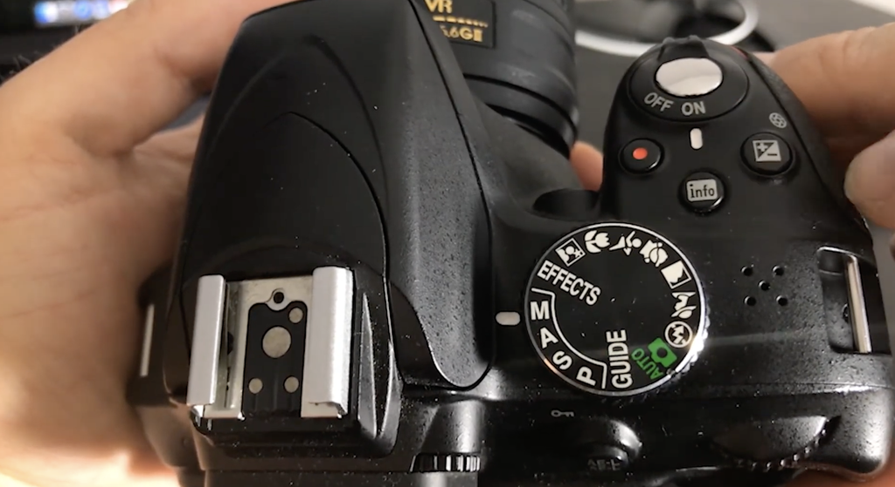
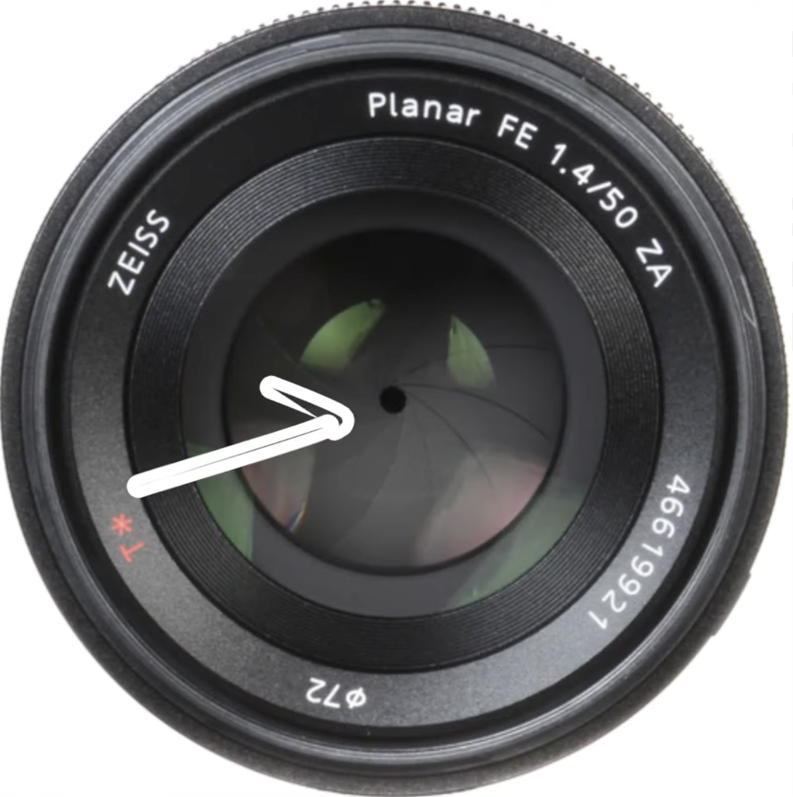
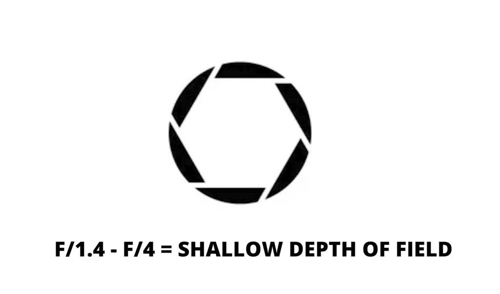
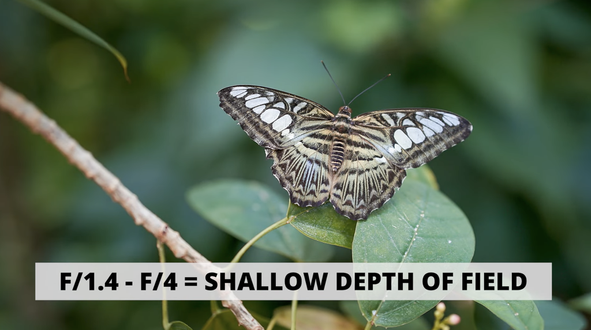
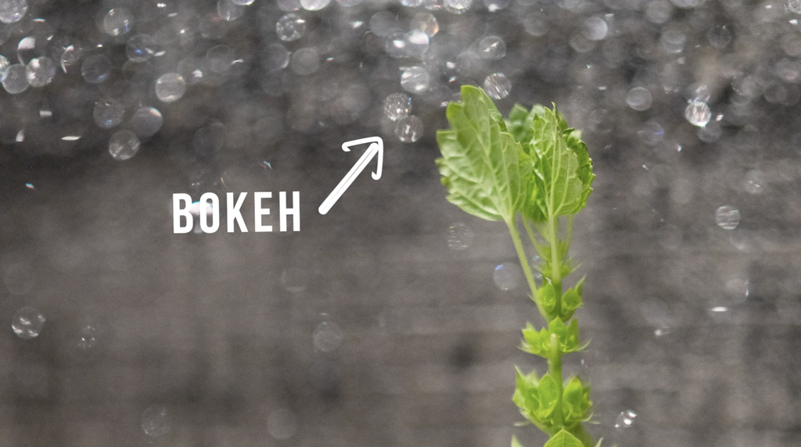
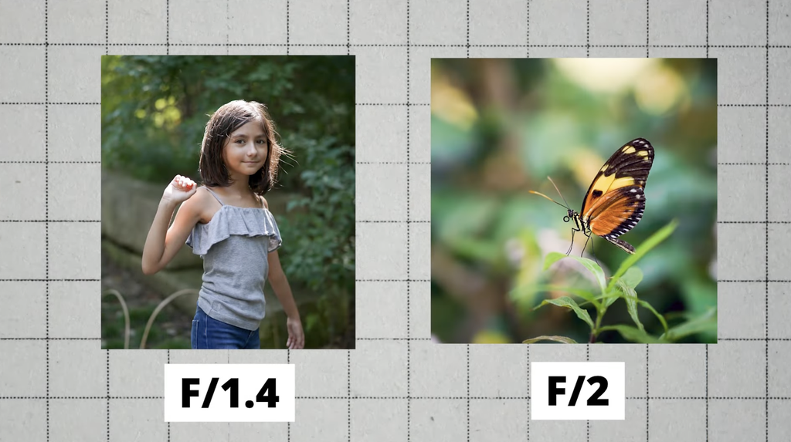
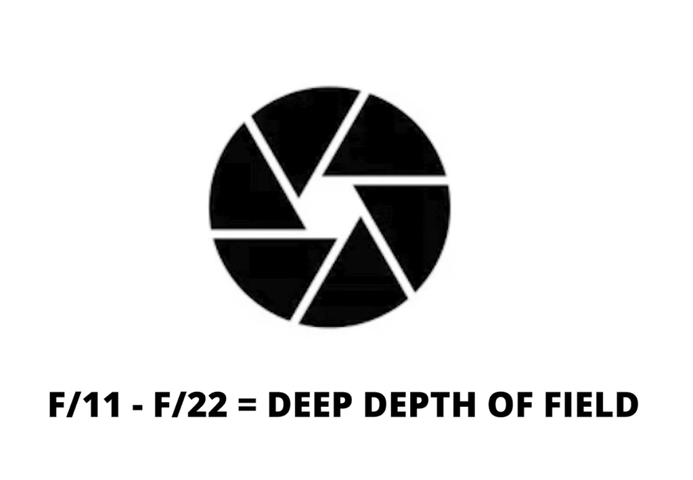
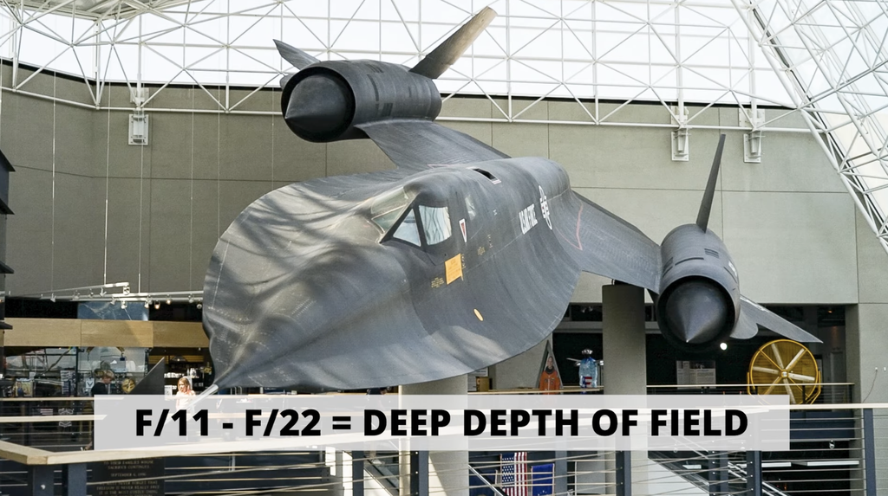

## Aperture setting guide Nikon D3300

<https://www.youtube.com/watch?v=7HRgLfAvR34>

To adjust the aperture press keep the camera in manual mode and keep pressing the +/- button near on/off button and move the same button that you used to adjust the shutter speed as shown in the picture above. It will adjust the Aperture.
When you will move the button to **Right** it will make the aperture smaller.
When you will move the button to **Left** it will make the aperture larger.

#### Aperture Guide general for all cameras.

<https://www.youtube.com/watch?v=n2HSoOq-rfo>

- Aperture is the opening in your camera lens that allows the light to pass though and reach the sensor.
- Aperture is measured in f-stops such as f 1.4, f 2, f 2.8 and so on. It is used to control the amount of light that enters your camera.
- Aperture also affects the depth of the field of the photo which is another way of saying how much of your picture is going to be sharp and in focus
- A lower f stop number such as f 1.4 will result in larger aperture opening which allow more light to enter the camera and result in shallower depth of field. That means your subject will be in focus and background will be blurry.

This is also what creates **BOKEH** in low light shooting.

A lower aperture number such as f/1.4 or f/2 is used when taking portraits or something small and wanted to stand out of the background

##### Higher Aperture

Higher F stop number such as F/16 will result in smaller aperture opening which allow less light to enter the camera result in less deeper depth of field which means both your subject and its background will be in focus.

Higher aperture is used stuff like landscaping, city scopes, architecture or anything that you want most of your frame in focus.
