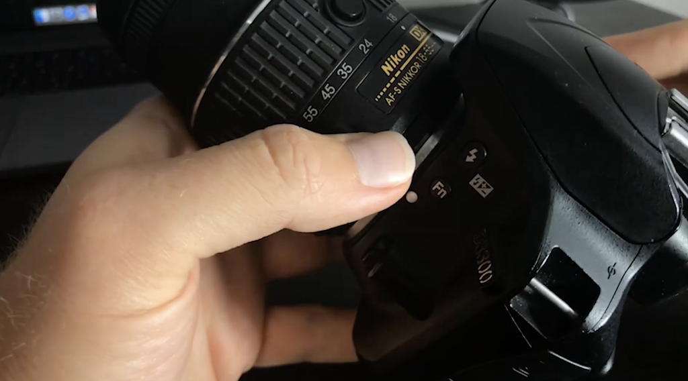
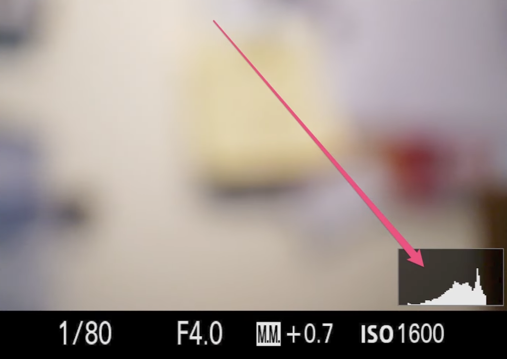
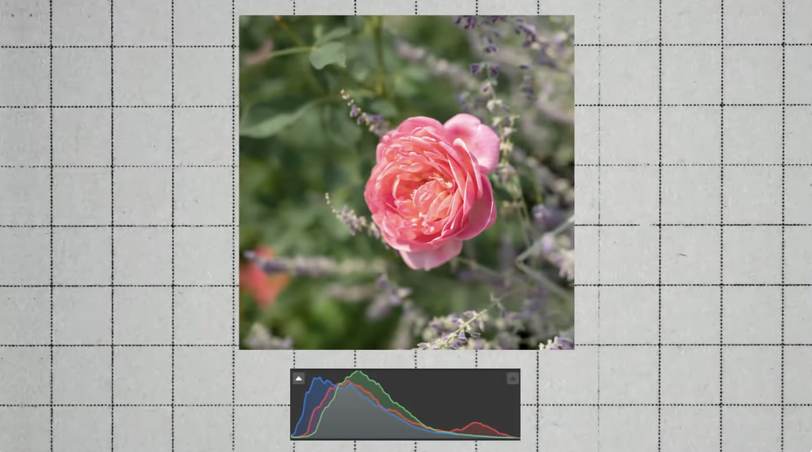

### # ISO setting guide to D3300

<https://www.youtube.com/watch?v=7HRgLfAvR34>

To adjust the ISO hold the (fn) button front of camera where we match the dot to the lens dot keep pressing it and move the same button.

When you will move the button to **Right** it will make the aperture higher.
When you will move the button to **Left** it will make the aperture lower.

### ISO Guide to all digital cameras.

<https://www.youtube.com/watch?v=n2HSoOq-rfo>

Unlike shutter speed and aperture which controls the physical mechanics of the camera, ISO works is digital (ISO International organization for standardization)

It refers to sensitivity of camera image sensor to light (Simple words adding exposure digitally)

ISO is measured in numbers 100, 200, 400 and so on.

- Lower the ISO number the less sensitive the camera sensor to the light and less noise in the image there will be.
- Higher ISO will make your image brighter but it also increase the amount of noise in the image.
- It is very similar to the amount to brightness in editing software. You tend to see good amount of noise and pixelation.
- You should typically use a lower ISO in bright situations such as sunny outdoor shooting.
- And higher ISO in lower light situations. But keep in mind as you increase ISO image will become grainy or noisy. I typically try to stay below 800 and sometime you have to increase it and there are software to fix the high ISO in editing.
- To avoid noise and grain first adjust aperture and shutter speed then worry about ISO.

To find out if your image is properly exposed
most of the cameras have handy little chart called histogram.

Every photographer need to make the histogram there best friend. what you need to look for graph been closer to the middle. which means your image is evenly exposed. Early photos of mine could have been better before i edited them and post. Also keep in mind histogram leaning to the left or right is not a bad thing either its good to see as general guideline.

