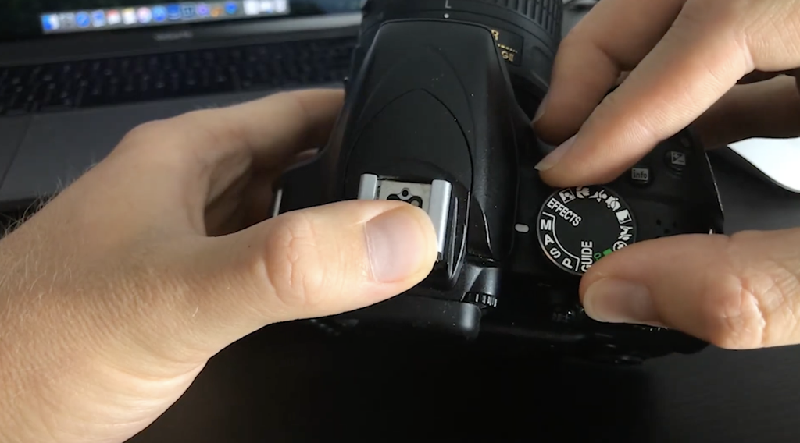
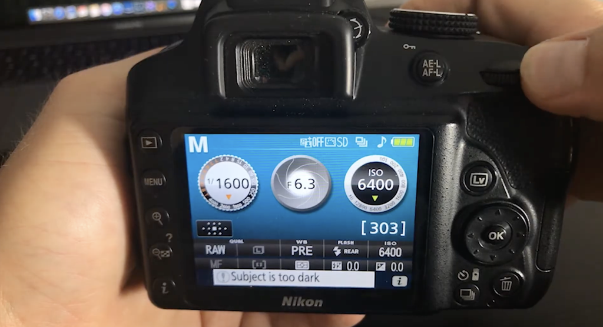
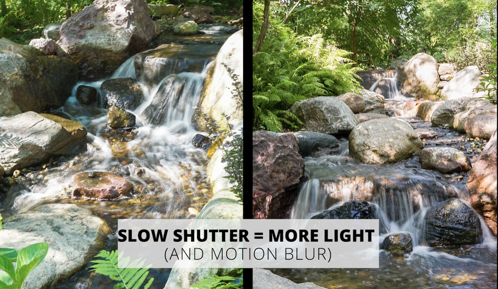
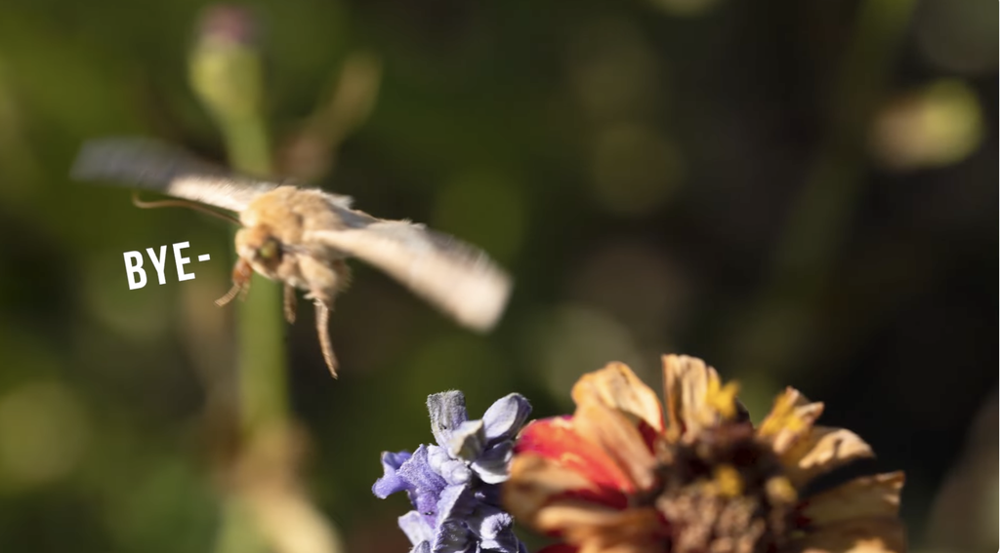
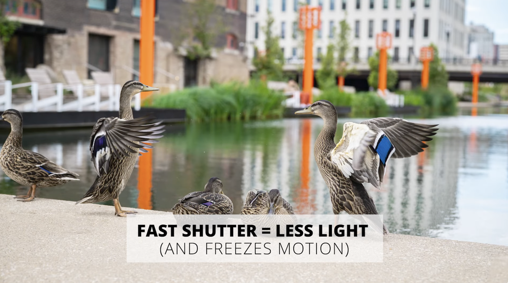

### Shutter speed guide to set on D3300

<https://www.youtube.com/watch?v=7HRgLfAvR34>

Now adjust the shutter speed

Now move the button to the **Right** it will speed up your shutter speed.
Move the button to the **Left** it will slow down your shutter speed.

##### You can do things like exposure, light trails with shutter speed.

### Shutter Speed guide to all cameras.

<https://www.youtube.com/watch?v=n2HSoOq-rfo>

Shutter speed is how fast the shutter opens and closes or length of how long the camera sensor is exposed to light when you click the shutter, it measured in seconds or fractions of seconds. such as 1/1000 second or 1/100 or 1/250 and so on.

Shutter speed along with other points of exposure triangle play very important role in overall exposure as well motion blur and freezing of motion in the image.

A slower shutter speed such as 1/80 or 1/50 of second allow more light to reach your camera sensor resulting in brighter image however it will also allow more time in the scene captured resulting in motion blur. This can be helpful in creating movement or motion in the photograph. Such as running river or moving car.

But it can also create a out of focus photograph. So it all depends on what kind of affect you are going for.

A faster shutter speed such as 1/1000 second or 1/2000 second will allow less light to reach the camera sensor making the picture darker (however it will also freeze the motion in the scene) which can be useful to capture sharp clear images of fast moving objects such as sports or wildlife or splash photography which is really really fun and also messy.

