#### Raw File Format.

- Raw image data is saved directly from the image sensor. This means RAW files must be processed on the computer before they are printed.
- Raw files are larger than JPEG files.
- Raw files have much broaded range of tones. shadow and high light areas have more details than other image files.
- You can extensively edit RAW files without losing any image data.

#### JPEG File Format.

- JPEG files are standard compressed files format that are supported by any image software.
- Becuase they are compressed they are very small comapred to RAW files. As a result they have narrower range of tones and loose some image data each time they are saved.

#### How to select the image quality

**Fastest Way** Press the i button, use the multiselector to select the image quality option, press the ok button, use the multiselector to make the selection and press ok. The other method to select the iamge quality is through shooting menu.

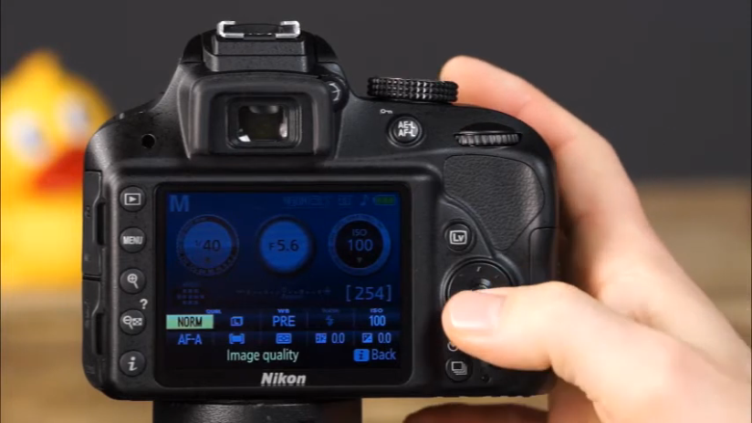

NEF ( RAW ) + JPEG fine You can choose to have one raw file and one JPEG file.
NEF ( RAW ) You can choose to have only raw file.
JPEG fine (least compression) Highest quality setting.
JPEG Normal (Moderate compression)
JPEG basic (Most compression)
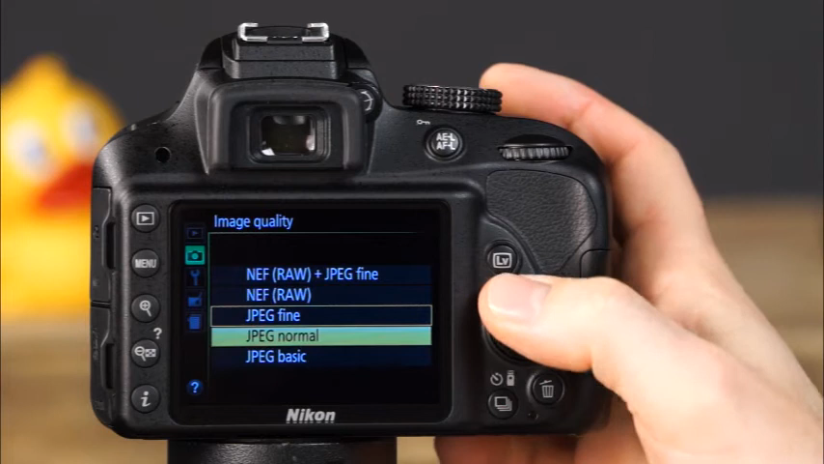

#### How to select the image size

Press i button, navigate to image size option then select the image size and press ok.
You can also select the same from shooting menu.
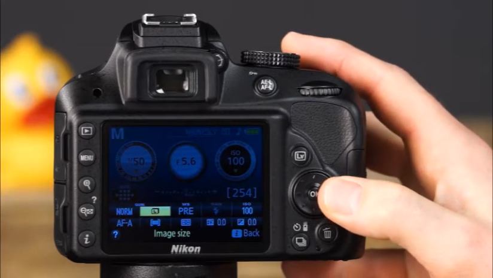
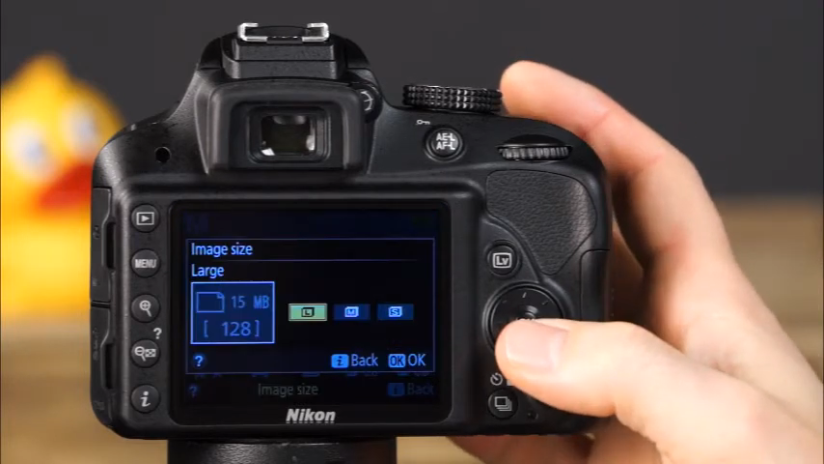

#### Metering Mode

There are three way D3300 measure three lights. To select the metering mode press the i button and select the metering and press teh ok.
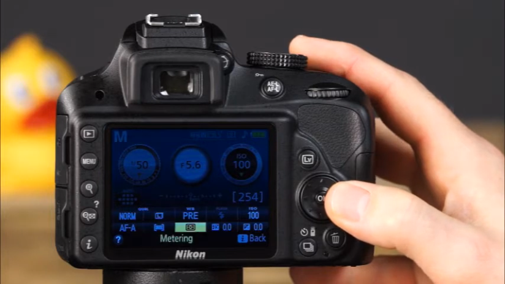
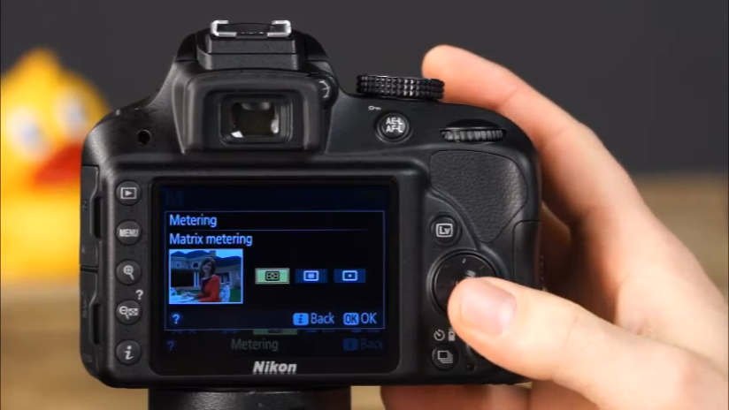
here you can choose between

- Matrix metering - Its general use metering mode. That can be used in most shooting scenarios. When this mode is selected the camera will divide the scene into zones. Then the camera measure and highlights in each zone and averages all of the zones, then the camera uses that average to set the exposure automatically to suit the scene. This is good use for many situations but when the scene is very bright or dark you may want to use different metering mode.
  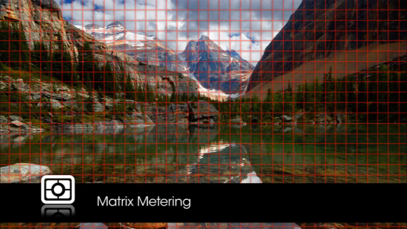
- Center-weighted metering - It is much like matrix metering mode with zones being evaluated and averaged. With center metering the zones that are center area of the frame are given the greatest weight, the zones that are outside of the the center area of the frame are taken into account as well but these given much less priority when determining the exposure. These center weighted metering is a classic mdoe used for portraits.
  
- Spot metering- It works almost the same way as the center weighted metering but spot metering uses only 2.5% of the frame to determine proper exposure. When spot metering is used on the D3300 the area that is used to meter exposure is the center of the selected focus point this feature is easier to meter off center subjects spot metering is a great mode to use when there is lot of contrast between the background and the subject when the background is either very bright or very dark.
  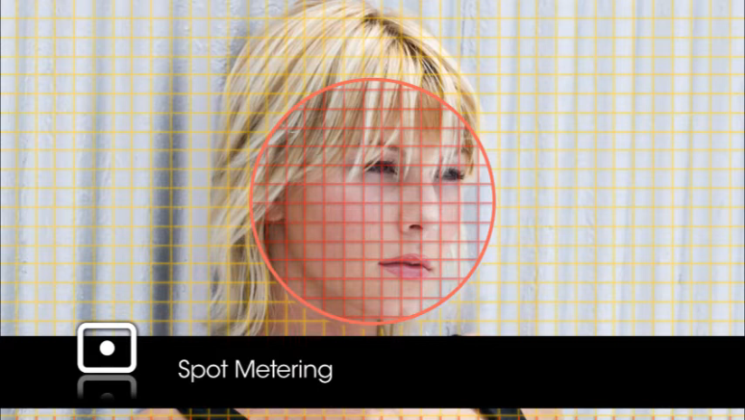

### Guide Mode

Guide mode will show how to quickly and easily make adjustments to the camera settings to capture variety of subjects and scenes.

- Rotate the dial to the guide mode and camera will show guide mode. This menu includes shoot, view/delete, retouch and setup.
  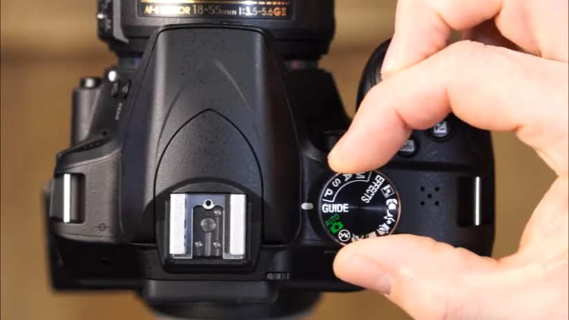
  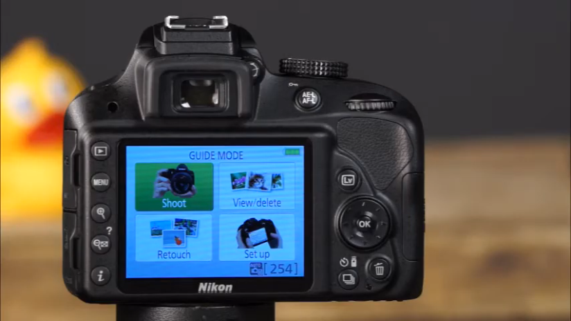
  First look at the shoot menu. Where there are two options Easy operations and Advanced operations. With easy operation you can choose from variety of options ranging from auto mode to each of the scene modes available on camera. You can view more information about this by pressing ok. To continue to use that setting press ok again. You can choose from three different options for shooting. You can use the viewfinder, live view, shoot movies. If you press on more settings that are available to the mode you have selected.
  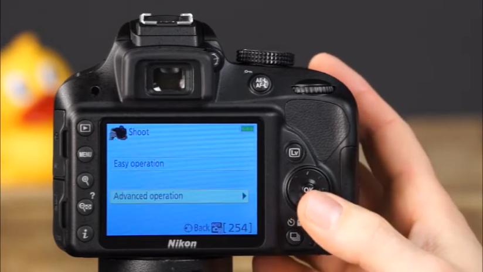
  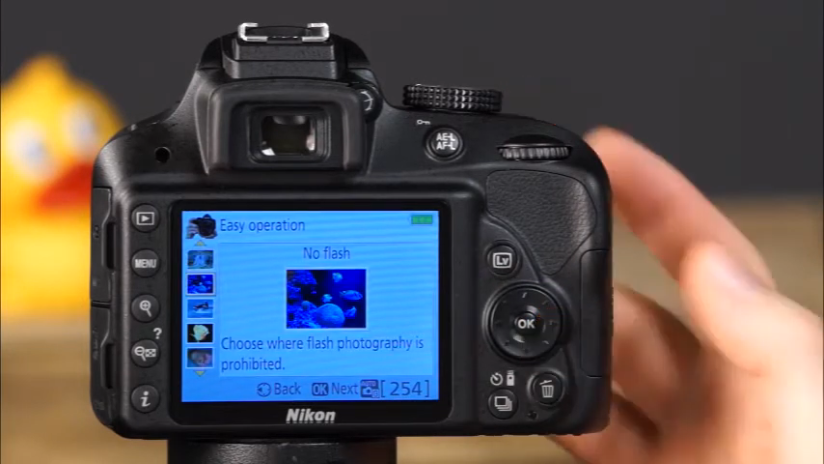
  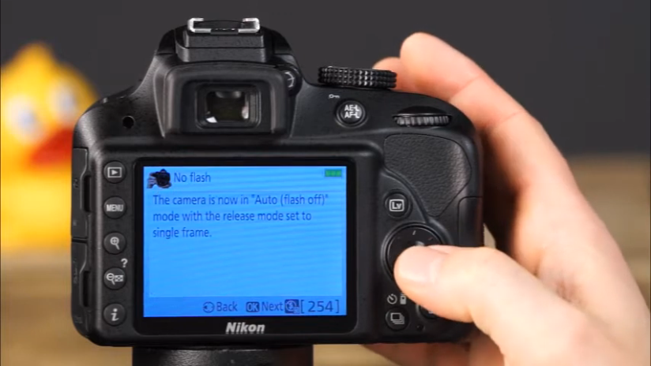
  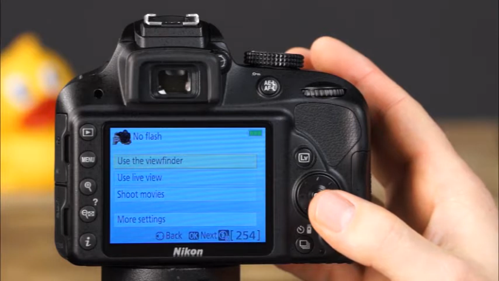
  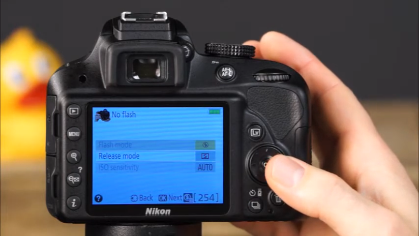
  go back to viewfinder setting to take the pictures. After that press the shutter button halfway down to focus and then rest of the way down to take the picture.
- 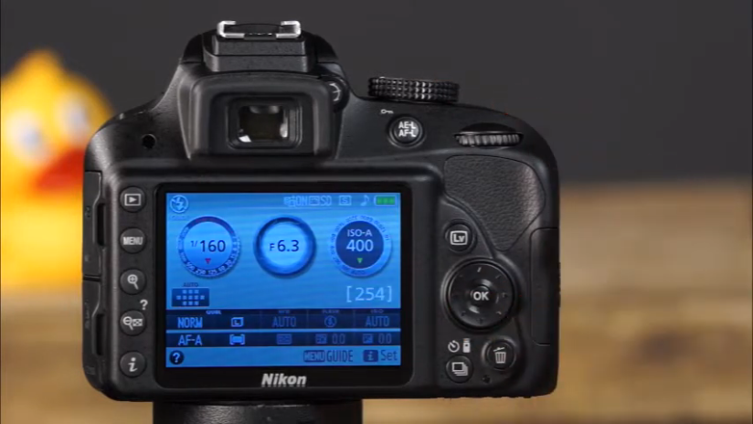

### Advanced Mode (Guide Mode)

Go to advanced mode and press the freeze mode and then press ok again it will provide you with how that mode functions. Then press ok button to continue to make adjustments according to the information provided by the mode. when you finish making adjustments press ok again. And select the method for shooting and now simply take the picture.

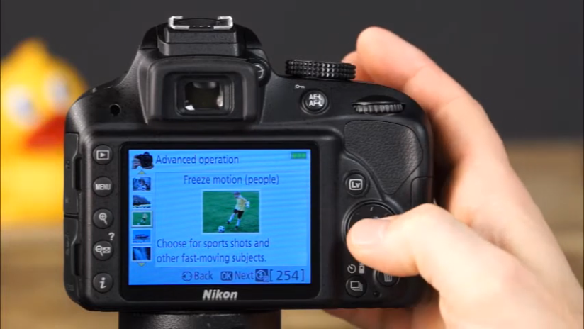

Also in the guide mode menu you can access the view/delete menu. In this menu you can choose to view single photo, multiple photo, choose a day of view slide show, and you can also delete the photos.
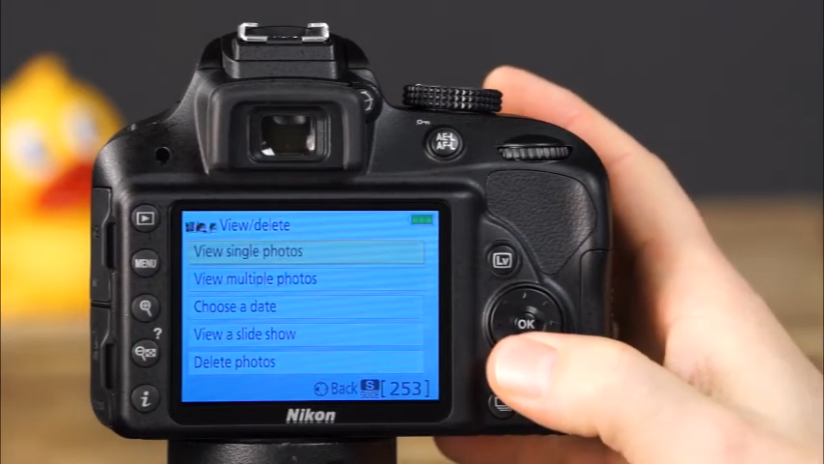

Next guide mode menu is retouch menu where you can apply variety of retouch like trim, crop images
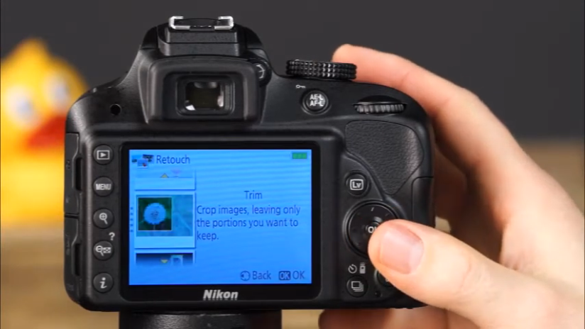

Setup menu, you can select from variety of setup options including image quality, image size , auto off timers, print date, display and sound settings, movie settings, playback folder, playback display options, and many more settings.
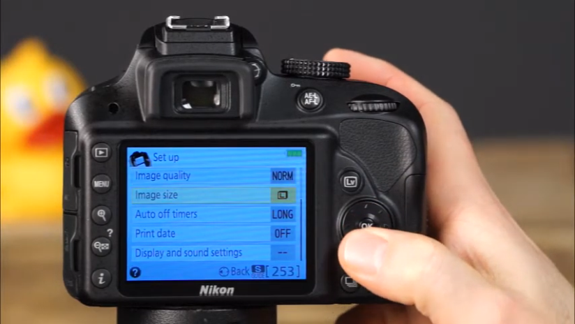
